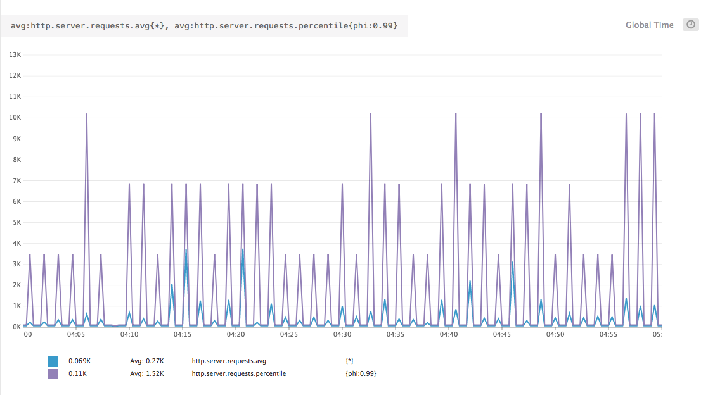

## Reliability Engineering Exercise

This is a simple application for the Spring Reliability Engineering exercise. To see my answers to the questions, head over to the [Questions](/Questions.md).


### Running this Application

This application uses [DataDog](https://www.datadoghq.com/) as a monitoring solution and a Datadog API key is required to run. However, it will be easy to switch to any monitoring solution supported by [Micrometer](https://micrometer.io/docs).

##### Running Locally
```bash

# If you don't have redis
brew install redis

# or you can use docker
docker-compose up -d 

export DATADOG_API_KEY=YOUR_API_KEY

./gradlew bootRun

# To view all available metrics
curl http://localhost:8081/actuator/metrics
```

##### Load Tests

For simplicity and explainability, load tests were constructed in JMeter. In the future, this project will likely include Gatling load tests as well.  

```bash
jmeter -n -t <LOAD-TEST>.jmx -Jhost=<HOST-OF-APP> -Jport=<PORT-OF-APP>
```

## Background

This repo is an example of a simple Spring application that might exhibit two specific latency and throughput behaviors.

These behaviors are:

### 1. A higher mean in latency than the 99th percentile.

This behavior requires a small subset of requests to be extreme outliers in the latency distribution. This long tail distribution of latencies results in in a mean that is actually above even the 99th percentile of requests. A simple JUnit test that shows how this is possible is viewable [here](https://github.com/matthewmcnew/Reliability-Engineering-Exercise/blob/master/src/test/java/com/mattcnew/reliability/LatencyDistribution.java).

To recreate this behavior in a load test an endpoint was created that irregularly (1/100ish) times requires an expensive operation. This operation could be a cache miss, a slow network operation or even a periodic expensive computation. The load test regularly calls this endpoint and the occasional outlier in latency drags the mean of latency above even the 99th percentile. A graph over an hour of this load test executing is shown below.    


Notice the graph shows that the average (gray line) usually remains above even the purple 99th percentile. This is the result of the orange line which represents the max latency and is an order of magnitude greater than the 99th percentile and the average latency. (The graph is on a logarithmic scale.) In a more realistic scenario, the max latency would not be so static.

For reference, the throughput graph across the same period is shown below.


**The Load Test**

The [load test](MeanAbove99.jmx) for this scenario executes one thread group with multiple threads that consistently polls the "/occasional-image-processing" endpoint. 

### 2. Periodic and regular spikes in throughput and latency.

*(Note: the following is a purely theoretical situation that most likely was not the cause of the sample graphs for this exercise.)*  

In order to recreate this behavior, a Spring Webflux app is used that has a simulated caching layer. The vast majority of requests do not need the cache or even use a value found in the cache. A small subset of requests are ‘cache misses’ that require additional processing or an expensive network lookup.

To simulate the irregular ‘cache miss’ a spring caching layer with a Redis backend is utilized. A time to live (ttl) on the cache is set to 1 minute. During the load test values will regularly expire in the cache and require ‘cache miss’ lookups. A 20 second `Thread.sleep` is added to the code path that is executed when a lookup is required. This thread sleep obviously delays the response of the request that hits the ‘cache miss’. However, the thread pause has implications for other requests.

Spring Webflux utilizes an intentionally small number of threads and achieves powerful concurrency by relying on the reactive paradigm and nonblocking I/O. The thread sleep is a blocking operation that prevents the thread from processing new or existing requests. In this simulated setup, a queue of requests begins to build upon the thread with the thread sleep. In a real Webflux application, blocking network calls, database lookups, or even computationally expensive operations could achieve the same result and completely exhaust a thread.

When the cache miss and thread sleep is over the thread can process the backed up requests. Because the application was unable to process these requests while they were waiting the ‘waiting time’ is not included in the time measurement or the throughput calculation. The application quickly works through the requests in the queue and includes them in the monitoring calculations. This flurry of requests may result in the spikes in throughput. This behavior is evident in the sample graphs shown below generated from a simplistic load test. 


Notice the periodic spikes in throughput are correlated with massive spikes in max latency. 

In this example, the mean is not typically higher than the 99th percentile. However, It would be possible in the future to adjust the ratios to generate a mean that is higher than the 99th percentile. A graph of the mean and the 99th percentile is shown below. 



**The Load Test**

The [load test](SpikesInThroughput.jmx) for this scenario executes two thread groups. One thread group consistently polls the ‘/cache-lookup’ endpoint that occasionally triggers a cache miss and simulates a subset of traffic that occasionally requires expensive thread blocking operations. Another thread group simulates consistent high volume and quick low latency traffic by hitting the "/no-lookup" endpoint. Because calls to this endpoint may be stuck waiting for the expensive operation to finish, the HTTP calls in this thread group have low timeouts.  
